# SMARTi-P — LMS-Monorepo

**SMARTi-LMS** ist ein Learning Management System für Eltern und Kinder, mit einer eigenständigen Marketing-App **FFG (Fit fürs Gymnasium)**.

---

## Architektur

```
smartispace/
├── package.json                  ← npm Workspaces Root (packages/*, apps/*)
├── packages/                     ← Shared Packages (intern, nicht auf npm)
│   ├── smarti-api/               ← @smarti/api — Orval-generierte Hooks + openapi.json
│   ├── smarti-ui/                ← @smarti/ui — shadcn/ui + cn()-Helper
│   ├── smarti-players/           ← @smarti/players — Player-Komponenten + Registry
│   └── smarti-session/           ← @smarti/session — SessionShell + useSession
├── apps/
│   ├── parent/                   ← SMARTi App (Vite SPA, Eltern-Portal)
│   └── kids/                     ← FFG Demo App (Vite SPA, Kinder-Lern-App)
├── backend/                      ← Django + Django-Ninja API
│   ├── src/smarti/               ← Clean Architecture (Domain/Application/Infrastructure)
│   ├── src/dweb/                 ← Django-Apps (API-Endpoints, Models)
│   ├── tests/                    ← Backend Tests
│   └── Dockerfile
├── docker-compose.yml            ← Lokale Entwicklung (db, backend, parent, kids, minio)
├── .env                          ← Lokale Secrets (nicht committen)
├── docs/                         ← Specs, Design-Docs, Features
│   ├── features/specs/<domain>/  ← Feature-Spezifikationen + INDEX.md
│   └── design/                   ← Architektur-Docs (doc4, doc5, doc8)
├── tools/                        ← MCP-Server (backend, frontend)
├── .opencode/                    ← AI-Agenten-Konfiguration
│   ├── opencode.json             ← MCP-Server
│   ├── agents/                   ← designer, architect, coder, tester, deployer
│   ├── command/                  ← /designer, /architect, /coder, /tester, /deployer
│   ├── skills/                   ← Skills (Übersicht: AGENTS.md §3)
│   ├── rules/                    ← backend, frontend, general, security, testing
│   └── shared/                   ← workspace, context, architecture, naming-conventions
└── x-agent/                      ← Agent-Artefakte (Pläne, Reports)
```

---

## Quick-Start

Voraussetzungen: [Docker](https://docs.docker.com/engine/install/), [uv](https://docs.astral.sh/uv/getting-started/installation/), [Node.js](https://nodejs.org/) ≥ 20

```bash
# 1. Repository klonen
git clone https://github.com/ffg-smarti/smartispace.git && cd smartispace

# 2. npm Workspaces installieren (einmalig)
npm install

# 3. Backend .env anlegen (einmalig)
#   Variable-Referenz: docs/design/doc8-deployment.md §6 (die .env.example-Vorlagen wurden entfernt)
touch backend/.env   # Werte eintragen (DATABASE_URL, SECRET_KEY, CORS_ALLOWED_ORIGINS, ...)

# 4. Datenbank + MinIO starten
docker compose up -d db minio

# 5. Backend installieren + Migrationen
cd backend
uv sync
uv run smarti dj migrate
cd ..

# 6. Backend + Frontend starten (je ein Terminal pro Befehl)
uv run smarti dj runserver                              # Port 8000
npm run dev --workspace=apps/parent                     # Port 8080
npm run dev --workspace=apps/kids                       # Port 8081 (optional)
```

---

## Applikation starten

Die Applikation besteht aus fünf Diensten: Datenbank (PostgreSQL), Object Storage (MinIO), Backend (Django), SMARTi App (apps/parent) und FFG Demo App (apps/kids).

### Variante A: Docker (empfohlen)

Beim ersten `docker compose up` werden die Container automatisch gebaut. Der Build dauert beim ersten Mal einige Minuten.

```bash
# 1. Container beim ersten Mal bauen (optional — docker compose up -d baut automatisch)
docker compose build

# 2. Alle Dienste starten (DB, MinIO, Backend, Parent, Kids)
docker compose up -d

# 3. Migrationen ausführen (einmalig / nach Schema-Änderungen)
docker compose exec backend uv run smarti dj migrate

# 4. Superuser anlegen (einmalig)
docker compose exec backend uv run smarti dj createsuperuser

# 5. Prüfen ob alles läuft
curl http://localhost:8000/api/v1/health/
# → {"status": "ok"}
```

| Dienst             | URL                               |
| ------------------ | --------------------------------- |
| Backend API        | http://localhost:8000             |
| API Docs (Swagger) | http://localhost:8000/api/v1/docs |
| SMARTi App         | http://localhost:8080             |
| FFG Demo App       | http://localhost:8081             |
| MinIO Console      | http://localhost:9001             |

```bash
docker compose down              # Alle stoppen
docker compose down -v           # Stoppen + Volumes löschen (Daten weg)
```

### Variante B: Nativ (Hot-Reload)

Nur die Datenbank läuft in Docker, Backend und Frontends direkt auf dem Host.

**Voraussetzung:** `.env`-Dateien anlegen (nur beim ersten Mal nötig):

```bash
# Root .env (Datenbank + MinIO) — wird von minio.py geladen
cp .env .env.local  # Falls nicht vorhanden, .env direkt verwenden

# Backend .env (Django-Konfiguration) — Referenz: doc8 §6
touch backend/.env   # Werte eintragen (DATABASE_URL, SECRET_KEY, ...)

# Frontend .env (VITE_API_URL)
# Optional: cp apps/parent/.env.example apps/parent/.env.local (falls vorhanden)
```

**Starten:**

```bash
# 1. Nur DB + MinIO in Docker starten
docker compose up -d db minio

# 2. npm Workspaces installieren (einmalig, im Repository-Root)
npm install

# 3. Backend-Abhängigkeiten installieren
cd backend && uv sync && cd ..

# 4. Migrationen ausführen
uv run smarti dj migrate

# 5. Backend starten (Port 8000)
uv run smarti dj runserver

# 6. SMARTi App starten (Port 8080) — in einem zweiten Terminal
npm run dev --workspace=apps/parent

# 7. FFG Demo App starten (Port 8081) — optional, in einem dritten Terminal
npm run dev --workspace=apps/kids
```

**Shared Packages im Watch-Modus** (optional, für Package-Entwicklung):

```bash
npm run dev --workspace=packages/smarti-players   # tsc --watch
```

**Alternative via CLI:**

```bash
uv run smarti demo start
# → startet automatisch Backend + Frontend nativ
uv run smarti demo status
# → prüft ob beide erreichbar sind
uv run smarti demo down
# → beendet alles
```

---

## OpenAPI-Schema generieren

Bei Änderungen an Django-Ninja-Endpoints muss das OpenAPI-Schema und die generierten TypeScript-Hooks aktualisiert werden.

```bash
# Schema exportieren (Django → packages/smarti-api/openapi.json)
npm run schema:export

# TypeScript-Hooks generieren (openapi.json → @smarti/api)
npm run schema:generate

# Beides in einem Schritt: Schema exportieren + Hooks generieren
npm run schema:build
```

| Befehl                    | Beschreibung                                                                                 |
| ------------------------- | -------------------------------------------------------------------------------------------- |
| `npm run schema:export`   | Exportiert das OpenAPI-Schema aus dem Django-Backend nach `packages/smarti-api/openapi.json` |
| `npm run schema:generate` | Führt Orval aus, um TanStack Query Hooks + Typen aus dem Schema zu generieren                |
| `npm run schema:build`    | Kombiniert export + generate in einem Schritt                                                |
| `npm run docker:up`       | Exportiert Schema, generiert Hooks und startet Docker-Compose                                |

---

## Container neu bauen

Die Docker-Umgebung verwendet **Hot-Reload-Volumes** — Code-Änderungen werden sofort übernommen, ohne dass der Container neu gebaut werden muss. Ein Rebuild ist nur nötig wenn sich die Build-Konfiguration ändert.

### Wann ist ein Rebuild nötig?

| Änderung                                                                  | Rebuild? | Grund                                    |
| ------------------------------------------------------------------------- | -------- | ---------------------------------------- |
| Code in `backend/src/`, `apps/parent/src/`, `apps/kids/src/`, `packages/` | **Nein** | Hot-Reload via Volume-Mounts |
| `Dockerfile` geändert                                                     | **Ja**   | Build-Image muss aktualisiert werden     |
| `package.json` / `package-lock.json` (Root)                               | **Ja**   | npm-Abhängigkeiten ändern sich           |
| `pyproject.toml` / `uv.lock` (Backend)                                    | **Ja**   | Python-Abhängigkeiten ändern sich        |
| Neue npm-Pakete in `packages/*/package.json`                              | **Ja**   | Workspace-Abhängigkeiten                 |
| Neue Python-Pakete in `backend/pyproject.toml`                            | **Ja**   | venv muss neu synchronisiert werden      |
| `.env`-Dateien geändert                                                   | **Nein** | env wird bei `docker compose up` gelesen |
| DB-Schema geändert (neue Migration)                                       | **Nein** | Migrationen manuell ausführen            |

### Rebuild-Befehle

```bash
# Alles neu bauen (wenn Dockerfile, package.json oder pyproject.toml geändert)
# Cash leeren
docker builder prune -af 
# prüfen wie viel Platz vom Cash verwendet wird
docker system df
# Netwerke löschen
docker system prune -af
# alles neu bauen
docker compose up --build

# besser einzeln bauen
# Nur Backend neu bauen (bei Python-Änderungen)
docker compose up --build backend

# Nur Frontends neu bauen (bei npm-Änderungen in packages/)
docker compose up --build parent kids

# Neu bauen ohne Cache (bei Build-Problemen)
docker compose up --build --no-cache

# Volumes zurücksetzen, DB bleibt erhalten
docker compose up -V
```

### Hot-Reload-Volume-Mounts

Die exakten Mounts stehen in `docker-compose.yml` (Services `backend`, `parent`, `kids` mounten `src/` + `packages/`).

Bei reinen Code-Änderungen (keine neuen Pakete) genügt `docker compose up` ohne `--build`.

---

## CLI (smarti)

```bash
# working-directory: apps/parent
# name: Generate API types
run: npm run generate --workspace=packages/smarti-api

# Alles in einem (aus dem "packages" Ordner):
npm run schema:build

# name: Type-check
run: npm run typecheck

# name: Lint
run: npm run lint

# name: Test
run: npm run test:run

# working-directory: <repository-root>
uv run smarti --help

# working-directory: backend
# name: Lint
run: uv run ruff check src/
# name: Run pyrefly
run: uv run pyrefly check --summarize-errors --min-severity error
# Copntract tests - langsamme Tests, die lange dauern
uv run pytest tests/contract/test_openapi_contract.py -v --tb=short
# Contract tests
CI=true uv run pytest tests/contract/test_openapi_contract.py -v --tb=short --junitxml=build/reports/contract-tests.xml
```

| Befehl                     | Beschreibung                                                                                    |
| -------------------------- | ----------------------------------------------------------------------------------------------- |
| `smarti demo start`        | All-in-One: check-deps + install + up + status                                                  |
| `smarti demo check-deps`   | Prüft ob Node.js und uv installiert sind                                                        |
| `smarti demo install`      | Führt `uv sync` in `backend/` aus                                                               |
| `smarti demo up`           | Startet Django-Dev-Server                                                                       |
| `smarti demo down`         | Beendet Dev-Server-Prozesse                                                                     |
| `smarti demo status`       | Prüft ob Server erreichbar sind                                                                 |
| `smarti demo docker-build` | Docker-Image neu bauen                                                                          |
| `smarti demo docker-up`    | Docker-Dev-Umgebung starten                                                                     |
| `smarti demo docker-down`  | Docker-Dev-Umgebung stoppen                                                                     |
| `smarti dj <cmd>`          | Django-Kommandos (migrate, createsuperuser, etc.)                                               |
| `smarti db reset [--nuke]` | Datenbank zurücksetzen. `--nuke` löscht zusätzlich alle Migration-Dateien und generiert sie neu |
| `smarti db backup`         | Erstellt ein pg_dump-Backup der PostgreSQL-Datenbank                                            |
| `smarti db restore <file>` | Stellt ein Backup wiederher (.sql via psql oder .json via dumpdata)                             |
| `smarti test`              | Test- und QA-Befehle (lint, format, unit-test)                                                  |
| `smarti clean`             | Löscht Build-Artefakte und temporäre Dateien                                                    |
| `smarti docs serve`        | MkDocs-Entwicklungsserver                                                                       |
| `smarti spec runserver`    | StrictDoc-Server für Specs                                                                      |

### Datenbank-Befehle

```bash
# DB komplett zurücksetzen (DROP SCHEMA + migrate)
smarti db reset

# DB zurücksetzen + Migration-Dateien neu generieren (voller Reset)
smarti db reset --nuke

# Backup erstellen
smarti db backup
# → backups/db/db_backup_20260630_130000.sql

# Backup wiederherstellen
smarti db restore backups/db/db_backup_20260630_130000.sql
```

---

# Agenten System

```mermaid
flowchart TB
    subgraph CHAIN["Lifecycle — Phasenübergänge nur mit User-Genehmigung (rules/general.md)"]
        direction LR
        PH1["Feature spezifizieren"] -->|User-Gate: Planned| PH2["Feature designen"]
        PH2 -->|User-Gate: Designed| PH3["Feature implementieren"]
        PH3 -->|User-Gate: In Progress| PH4["Feature testen"]
        PH4 -->|User-Gate: Tested| PH5["Feature deployen"]
        PH2 -.->|designer --update / Architect-Update-Modus| PH1
        PH4 -.->|In Review → Coder-Nacharbeit| PH3
    end

    subgraph SGD["designer — spezifiziert mit PM → Planned"]
        direction TB
        AG_D["designer"] --> SK_RA["requirements-analyst"]
        AG_D --> SK_SWR["spec-writing [requirements]"]
        SK_RA -.-> SK_SWR
        SK_SWR --> A_SPEC["*-spec.md"]
        SK_SWR --> A_RBRIEF["x-agent/requirements-brief"]
    end

    subgraph SGA["architect — designed → Designed"]
        direction TB
        AG_A["architect"] --> SK_SA["solution-architect"]
        SK_SA --> SK_AB["architect-backend"]
        SK_SA --> SK_AF["architect-frontend"]
        SK_AB --> SK_SWD["spec-writing [design]"]
        SK_AF --> SK_SWD
        SK_SWD --> A_DSGN["*-design.md"]
        SK_SWD --> A_ADOC["x-agent/architecture-document"]
        SK_SWD --> A_AREP["x-agent/architect-FEAT-ID"]
    end

    subgraph SGC["coder — implementiert → In Progress"]
        direction TB
        AG_C["coder"] --> SK_DP["domain-pattern"]
        AG_C --> SK_AP["appl-pattern"]
        AG_C --> SK_IP["infra-pattern"]
        AG_C --> SK_PP["presentation-pattern"]
        AG_C --> SK_RP["result-pattern"]
        AG_C --> SK_UP["ui-pattern"]
    end

    subgraph SGT["tester — testet → Tested / In Review"]
        direction TB
        AG_T["tester"] --> SK_UT["unit-test-backend"]
        AG_T --> SK_IT["integration-test-backend"]
        AG_T --> SK_UIT["ui-test-frontend"]
        AG_T --> SK_E2E["e2e-test"]
    end

    subgraph SGP["deployer — Pipeline-Design (keine Ausführung)"]
        direction TB
        AG_P["deployer"] --> SK_PB["project-build"]
        AG_P --> SK_AB2["app-build"]
        AG_P --> SK_BB["backend-build"]
    end

    PH1 --> AG_D
    PH2 --> AG_A
    PH3 --> AG_C
    PH4 --> AG_T
    PH5 --> AG_P

    BASE["Base-Kontext (Vorarbeit): doc-router · AGENTS.md · context.md · workspace.md · general.md<br/>+ INDEX.md (ohne deployer) · tech-stack (architect/coder/tester) · naming-conventions (ohne architect)<br/>+ PD.md nur designer · doc8 nur deployer · Backend-/Frontend-Rules kommen über die Detail-Skills"]
    AG_D -.-> BASE
    AG_A -.-> BASE
    AG_C -.-> BASE
    AG_T -.-> BASE
    AG_P -.-> BASE

    classDef agent fill:#0050ef,color:#fff,stroke:#001DBC
    classDef skill fill:#60a917,color:#fff,stroke:#2D7600
    classDef art fill:#f5f5f5,color:#333,stroke:#666
    classDef base fill:#e3c800,color:#000,stroke:#B09500
    classDef phase fill:#fff,stroke:#333
    class AG_D,AG_A,AG_C,AG_T,AG_P agent
    class SK_RA,SK_SWR,SK_SA,SK_AB,SK_AF,SK_SWD,SK_DP,SK_AP,SK_IP,SK_PP,SK_RP,SK_UP,SK_UT,SK_IT,SK_UIT,SK_E2E,SK_PB,SK_AB2,SK_BB skill
    class A_SPEC,A_RBRIEF,A_DSGN,A_ADOC,A_AREP art
    class BASE base
    class PH1,PH2,PH3,PH4,PH5 phase
```



## Agenten-Commands (`.opencode/commands/`)

Commands werden im Agenten via `/command-name` aufgerufen (Details: AGENTS.md §3):

| Command | Beschreibung |
| ------- | ------------ |
| `/designer` | Funktionale Anforderungen eines Features spezifizieren |
| `/architect` | Architektur für ein Feature entwerfen |
| `/coder` | Feature in DDD-Schichten implementieren |
| `/tester` | Unit-, Integrations-, UI- und E2E-Tests implementieren und ausführen |
| `/deployer` | Build-/CI/CD-Pipeline gestalten (`project`, `app-Kids`, `app-Parent`) |

---

## Subagenten (`.opencode/agents/`)

Subagenten werden von Commands via Task-Tool orchestriert (Details: AGENTS.md §3):

| Agent | Beschreibung |
| ----- | ------------ |
| `designer` | Spezifiziert funktionale Anforderungen (→ `Planned`) |
| `architect` | Entwirft die Architektur (→ `Designed`) |
| `coder` | Implementiert das Feature (→ `In Progress`) |
| `tester` | Testet gegen Spec + Design (→ `Tested` / `In Review`) |
| `deployer` | Gestaltet die Build-/CI/CD-Pipeline |

---

## MCP-Server

| Server        | Zweck                                                                               |
| ------------- | ----------------------------------------------------------------------------------- |
| `filesystem`  | Dateioperationen (lesen/schreiben/suchen)                                           |
| `django`      | Django-Modelle, URLs, Settings inspizieren                                          |
| `sqlite`      | SQL-Abfragen auf die SQLite-Datenbank                                               |
| `postgres`    | SQL-Abfragen auf die PostgreSQL-Datenbank (localhost:5432)                          |
| `playwright`  | Browser-Automation                                                                  |
| `backend-mcp` | Backend-Tests (pytest, Schemathesis)                                                |
| `ffg-mcp`     | Frontend-Tooling für `apps/kids` (Vitest, ESLint, Dev-Server)                         |
| `smarti-mcp`  | Frontend-Tooling für `apps/parent` (Vitest, ESLint, Dev-Server)                       |

---

## Skills (`.opencode/skills/`)

Vollständige Skill-Übersicht: AGENTS.md §3 (Pattern-, Build- und Test-Skills je Aufgabe).

---

## Feature-Tracking

Aktueller Stand und alle Features: `docs/features/INDEX.md`

Jedes Feature durchläuft: **Roadmap → Planned → Designed → In Progress → In Review → Approved → Deployed** (Tester setzt `Tested`/`In Review`; Details: `rules/general.md`, AGENTS.md §3).
