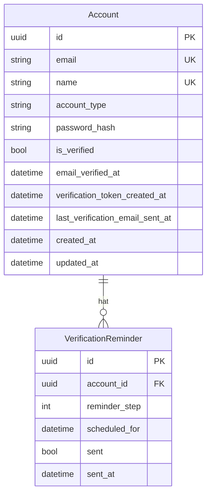

# FEAT-1: Parent Registration — Design

**Domain:** `account`
**Version:** 1.0
**Status:** 🟡 Designed
**Funktionale Anforderungen:** [`parent-registration-spec.md`](parent-registration-spec.md)
**Erstellt:** 2026-09-09
**Zuletzt aktualisiert:** 2026-09-09

---

## KI-Kontext

| Feld | Wert |
|------|------|
| **Zweck** | Technisches Design für FEAT-1: Parent Registration — Backend + Frontend |
| **Lies zuerst** | `parent-registration-spec.md` (Anforderungen), `account-domain-spec.md` |
| **Konsumenten** | Coder (Implementierung), Tester (Tests) |
| **Stabile Abschnitte** | §1 Architektur-Überblick, §2 Designentscheidungen |
| **Volatile Abschnitte** | §3 API-Kontrakt (basiert auf OpenAPI-Schema) |
| **Verwandte Specs** | keine bekannt |
| **Verwandter Code** | Backend: `backend/src/smarti/account/`, `backend/src/dweb/account/`; Frontend: `apps/parent/src/features/auth/` |
| **Offene Fragen** | §4 vor Implementierung lesen |

---

## 1. Architektur-Überblick

**Backend/Frontend/beides:** Beides
**Bounded Context:** `account`

### 1.1 Bounded Context Übersicht

**Verantwortlichkeit:** Verwaltung von Accounts — Registrierung (Eltern, Admin, Child, Staff), Verifizierungsstatus, E-Mail-Verifizierungs-Workflow

**Aggregate Root:** `Account` (mit `AccountType`-Diskriminator: `PARENT`, `ADMIN`, `CHILD`, `STAFF`)

**Abhängigkeiten (nur via ID + ACL):**
| Fremder Context | Referenziert als | Kommunikation |
|---|---|---|
| `account` | `AccountId` | — (eigenes Bounded Context) |
| (zukünftig) | — | ACL bei Feature-Erweiterungen |

### 1.2 ERD



**Beschriftungen:**
- `Account` — Aggregate Root: Account-Typ mit E-Mail, Name, Passwort-Hash, Verifizierungsstatus
- `VerificationReminder` — Value Object: Geplante Erinnerungs-E-Mails (24h, 7 Tage, 29 Tage)
- `email` — Eindeutiger Constraint
- `name` — Eindeutiger Constraint
- `account_type` — Diskriminator: `PARENT`, `ADMIN`, `CHILD`, `STAFF`

### 1.3 Layer-Design

| Schicht | Bausteine |
|---------|-----------|
| Domain | `Account` (Aggregate Root), `Email`, `AccountName`, `VerificationToken`, `PasswordHash`, `AccountType` (Value Objects), `ParentAccountRegisteredEvent`, `ParentVerificationEmailSentEvent`, `ParentVerificationReminderScheduledEvent` (Domain Events), `AccountType`, `VerificationStatus`, `ReminderStep` (Enums), `AccountDomainService` (Domain Service) |
| Application | `CreateParentAccount` (Command), `ParentAccountCreateDTO`, `ParentAccountReadDTO` (DTOs), `IAccountRepository`, `IUnitOfWork`, `IEmailService`, `IScheduledTaskService` (Ports), `dto2cmd_mapper` (Mapper), `CreateParentAccountHandler` (Handler) |
| Infrastructure | `AccountRepository` (ORM), `AccountUnitOfWork`, `parent_account_mapper` (ORM↔Domain), `hashers`, `email_sender`, `repo`, `query_services` (Adapters), `send_verification_email`, `send_24h_reminder`, `send_7day_reminder`, `send_29day_warning` (Celery Tasks) |
| Presentation | `ParentAccountCreateSchema`, `ParentAccountResponseSchema` (Django-Ninja Schemas), `POST /api/v1/account/register/`, `POST /api/v1/account/resend-verification/` (Endpoints mit `@handle_api_result`) |

### 1.4 Fehlerbehandlung

- **Result-Pattern:** `Result[T, BaseFailure]` über alle Schichten; `@handle_api_result` übersetzt Result → HTTP Response an API-Grenze
- **Domain Errors:** `EmailAlreadyRegistered`, `NameNotUnique`, `InvalidEmail`, `InvalidName` — fachliche Fehler als `Result`
- **Exceptions:** Invarianten- und technische Fehler als Exceptions (`DomainInvariantError`, `RepositoryError`)
- **Fail-fast:** Bei abhängigen Validierungen; **Akkumulation:** Bei unabhängigen Validierungen (Email + Name)
- **ErrorType → HTTP-Mapping:** 409 für E-Mail/Name-Konflikte, 422 für ungültige Eingaben, 500 für interne Fehler

### 1.5 App-Struktur

```
backend/src/dweb/account/                    # Presentation Layer (Django App)
├── api/
│   ├── schema.py                            # Django-Ninja Schemas
│   └── endpoints.py                         # Router + Endpoints mit @handle_api_result
├── models.py                                # ORM Models
├── urls.py
└── apps.py

backend/src/smarti/account/                  # Domain-Driven Design Layers
├── domain/
│   ├── model/account.py                     # Account Aggregate Root
│   ├── value_objects.py                     # Email, AccountName, VerificationToken, PasswordHash, AccountType
│   ├── events.py                            # ParentAccount* Events
│   ├── enums.py                             # AccountType, VerificationStatus, ReminderStep
│   └── services.py                          # AccountDomainService
├── appl/
│   ├── commands/registration.py             # CreateParentAccount Command
│   ├── dtos/parent_account_dto.py           # ParentAccountCreateDTO, ParentAccountReadDTO
│   ├── handlers/command/registration.py     # CreateParentAccountHandler
│   ├── mappers/dto2cmd_mapper.py            # DTO → Command Mapping
│   ├── ports/account_port.py                # IAccountRepository, IUnitOfWork, IEmailService
│   └── services.py
└── infra/
    ├── adapters/hashers.py, email_sender.py, repo.py, query_services.py
    ├── tasks/verification_tasks.py          # Celery Tasks
    ├── mappers/parent_account_mapper.py     # ORM ↔ Domain Mapping
    └── uow.py                               # Unit of Work
```

### 1.6 Frontend-Design

**App:** `apps/parent`

- **Komponentenbaum & Layering:** `RegistrationForm`, `RegisterPage`, `useRegistration`, `RegistrationSuccess`, `VerificationNotice` in `features/auth/`; Layering: `@smarti/ui` → `@smarti/api` → `features/auth` → `app`
- **Routing & Pages:** `/register` (öffentlich), `/register/success`; ProtectedRoute schützt authentifizierte Seiten
- **Data Flow & State:** TanStack Query (Server-State) + `useState` (Formular-Validierung); Provider-Reihenfolge: `ErrorBoundary` → `QueryClientProvider` → `BrowserRouter` → `AuthProvider`
- **API-Anbindung:** `@smarti/api` Orval-generierte Hooks; `POST /api/v1/account/register/`
- **Interaktionen/Registry:** Keine neuen Player-Typen nötig
- **Accessibility:** Formular-Labels, ARIA-Labels, Focus-Management, Keyboard-Navigation

---

## 2. Designentscheidungen

| ID | Entscheidung | Alternativen | Begründung |
|----|--------------|-------------|------------|
| D-01 | JWT-Auth via `django-ninja-jwt` | Session-basiert | Projekt-Standard gemäß Smarti-Stack, skaliert besser für APIs |
| D-02 | Celery + Redis für E-Mail-Scheduling | Sofort-Sendung nur | Feste Zeitpläne (24h, 7 Tage, 29 Tage) erfordern Hintergrundjobs |
| D-03 | PostgreSQL als Datenbank | SQLite | Produktions-Standard gemäß Smarti-Stack, eindeutige Constraints nötig |
| D-04 | shadcn/ui Komponenten für das Formular | Eigene Komponenten | apps/parent nutzt shadcn/ui via @smarti/ui — Projekt-Standard |
| D-05 | Self-Service-Registrierung (kein Admin) | Admin-erstellt Accounts | Explizite Geschäftsregel aus Requirements Brief |
| D-06 | @smarti/api für Frontend-API-Zugriff | Direkte Fetch-Aufrufe | Orval-generierte Typen sind Single Source of Truth, Typsicherheit gewährleistet |
| D-07 | Unverifizierte Accounts im Account-Status flaggen | Separate Tabelle | Einfache Zustandsverwaltung, kein Join nötig |
| D-08 | Result-Pattern: `Result[T, BaseFailure]` über Schichten | Exceptions für alles | Erwartbare fachliche Fehler als Result kontrollierbar; `@handle_api_result` übersetzt an API-Grenze |
| D-09 | Django-App `account` statt `dj_accounts` | `dj_accounts` | Smarti-Stack-Konvention: `backend/src/dweb/<domain>/` |
| D-10 | Events typ-spezifisch (`ParentAccount*`) | Generische Events | Ermöglicht Zuordnung zu anderen Account-Typen (Admin, Child, Staff) |
| D-11 | `AccountType`-Enum im Aggregate Root | Separate Tabelle | Einfache Diskriminierung innerhalb des Aggregates |

---

## 3. API-Kontrakt

### `POST /api/v1/account/register/`

**Zweck:** Registriert einen neuen Eltern-Account
**Request:** `email: string (unique, required)`, `name: string (unique, required)`, `password: string (required)`
**Response (201 Created):** `id: UUID`, `email: string`, `name: string`, `account_type: PARENT`, `is_verified: false`, `created_at: datetime`
**Fehlercodes:** `409` → `EMAIL_ALREADY_REGISTERED`, `NAME_NOT_UNIQUE`; `422` → `INVALID_EMAIL`, `INVALID_NAME`; `500` → `INTERNAL_ERROR`

### `POST /api/v1/account/resend-verification/`

**Zweck:** Sendet erneute Verifizierungs-E-Mail
**Request:** `email: string (required)`
**Response (200 OK):** `message: string`
**Fehlercodes:** `404` → `ACCOUNT_NOT_FOUND`; `400` → `ACCOUNT_ALREADY_VERIFIED`

---

## 4. Offene Fragen

| ID | Frage | Antwort | Status |
|----|-------|---------|--------|
| F-01 | Keine | Alle offenen Fragen aus der Spec wurden gelöst | `Entschieden` |

---

## 5. Implementierungshinweise

- **Betroffene Schichten:** domain / appl / infra / presentation / ui
- **Zu ladende Skills:** [`domain-pattern`, `appl-pattern`, `infra-pattern`, `presentation-pattern`, `ui-pattern`]
- **Offene Punkte:** Account-Typ-spezifische Handler für Admin/Child/Staff sind zukünftige Features; aktuell nur Parent-Registrierung implementiert
